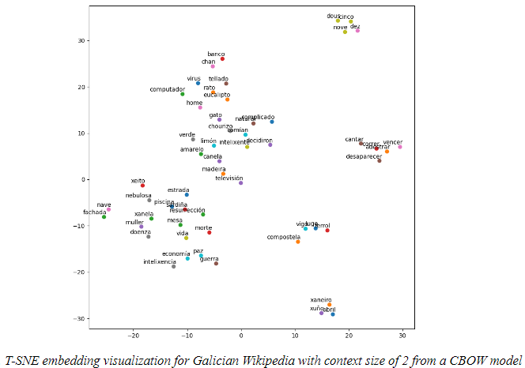
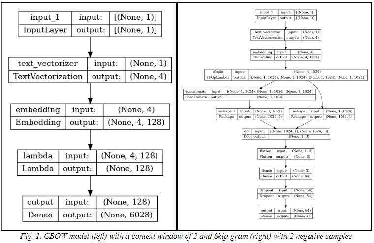

Word2Vec Embedding Analysis
===

Word2Vec is a popular technique for learning word embeddings using shallow neural networks. This project focuses on implementing and analyzing word embeddings using the Continuous Bag of Words (CBOW) and Skip-gram models. These embeddings capture semantic relationships between words and can be used in various NLP tasks.

## Dataset Description
The dataset used for this project consists of a large corpus of text data, which is essential for training high-quality word embeddings. Commonly used datasets include:

- Text8
- Wikipedia dump
- Custom large text corpus

The dataset should be preprocessed to remove noise and tokenize the text into words.

## Results showcase



## Install the environment in a local device
The following steps must be followed to install the dependencies required for running the application:

1. Navigate to the project directory
```
cd (`project_path`)
```

2. Create a conda environment from a .yml file
```
conda env create -f environment.yml
```

## Implementation Details
The implementation includes several scripts which are detailed below:
- train.py: Train a Word2vec model
- evaluate.py: Evaluate a previously trained Word2vec model using Accuracy metric
- hyperparameter_tuning.py: Perform an hyperparameter tuning using Optuna
- results_analyzer.py: Perform a qualitative analysis using a previously trained Word2vec model. For target words, compute Semantic Similarity with respect to the rest of the words in the vocabulary (cosine similarity) and visualize embeddings using T-SNE

Use the command ```python <script_name>.py –help``` for more information about the supported arguments.

## Project Structure
The project is organized as follows:

```
├── datasets
├── src
│   ├── embeddings.py
│   ├── hyperparameter_tuning.py
│   ├── loadfile.py
│   ├── fileparser.py
│   ├── model.py
│   ├── preprocess.py
│   ├── semantic_similarity.py
```

## Dependencies
The main libraries used in this project include:

- Tensorflow
- Keras
- scikit-learn
- tqdm
- optuna
- matplotlib
- numpy
- seaborn

## Methodology
### CBOW Model
The Continuous Bag of Words (CBOW) model predicts the target word based on its context words. It tends to be faster and is useful when the corpus is large.

### Skip-gram Model
The Skip-gram model predicts the context words given a target word. It works well with smaller datasets and captures semantic relationships effectively.

### Data Preprocessing
The data preprocessing step involves:

- Loading the text data: Reading the raw text files from the data/raw directory.
- Cleaning the data: Removing special characters, numbers, and stopwords.
- Tokenization: Splitting the text into words.
- Creating context-target pairs: Preparing the data for the CBOW and Skip-gram models.

### Model Architecture



### Evaluating Embeddings
The evaluation step involves:

- Loading the trained embeddings: Using the saved word vectors.
- Quantitative evaluation: Calculating metrics such as word similarity (most similar words in the vocabulary).
- Qualitative evaluation: Visualizing the embeddings using techniques like t-SNE.